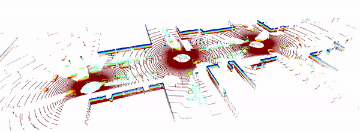
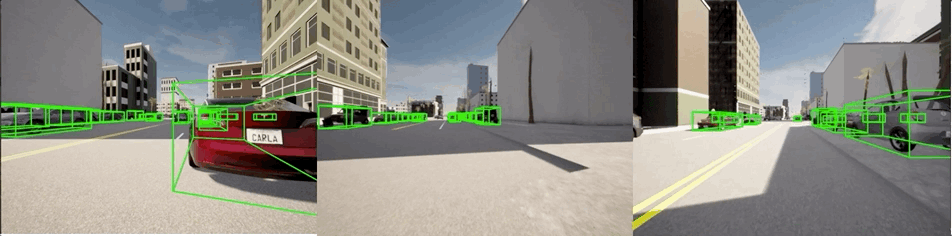

<div align="center">
  
  <div>&nbsp;</div>

  <div>&nbsp;</div>
</div>

[](https://arxiv.org/pdf/2109.07644.pdf)
[](https://opencood.readthedocs.io/en/latest/?badge=latest) 
[](https://opensource.org/licenses/MIT) 

OpenCOOD is an <strong>Open</strong> <strong>COO</strong>perative <strong>D</strong>etection framework for autonomous driving. It is also the official implementation of the <strong> ICRA 2022  </strong>
paper [OPV2V.](https://arxiv.org/abs/2109.07644)

<p align="center">


</p>

## News:
- 12/28/2022: OpenCOOD now support multi-gpu training.
- 12/21/2022: V2XSet (ECCV2022) is supported by OpenCOOD now!
- 12/16/2022: Both spconv 1.2.1 and spconv 2.x are supported! 
- 12/04/2022: The log replay tool for OPV2V is online now! With 
this toolbox, you can 100% replay all the events in the offline dataset and add/change any sensors/groundtruth you
want to explore the tasks that the origin dataset do not support. Check [here](logreplay/README.md) to see more details.
- 09/15/2022: So far OpenCOOD has supported several top conference papers, including ECCV,ICRA,CoRL,NeurIPS,WACV! The bottom of this project page lists the detailed information.
## Features
- Provide easy data API for multiple popular multi-agent perception dataset:
  - [x] [OPV2V [ICRA2022]](https://mobility-lab.seas.ucla.edu/opv2v/)
  - [x] [V2XSet [ECCV2022]](https://arxiv.org/pdf/2203.10638.pdf)
  - [ ] [DAIR-V2X [CVPR2022]](https://arxiv.org/abs/2204.05575)
  - [ ] [V2V4Real [CVPR2023 Highlight]](https://arxiv.org/abs/2303.07601)
- Provide APIs to allow users use different sensor modalities
  - [x] LiDAR APIs
  - [ ] Camera APIs
  - [ ] Radar APIs
- Provide multiple SOTA 3D detection backbone:
    - [X] [PointPillar](https://arxiv.org/abs/1812.05784)
    - [X] [Pixor](https://arxiv.org/abs/1902.06326)
    - [X] [VoxelNet](https://arxiv.org/abs/1711.06396)
    - [X] [SECOND](https://www.mdpi.com/1424-8220/18/10/3337)
- Support multiple sparse convolution versions
  - [X] Spconv 1.2.1
  - [X] Spconv 2.x
- Support  SOTA multi-agent perception models:
    - [x] [Attentive Fusion [ICRA2022]](https://arxiv.org/abs/2109.07644)
    - [x] [Cooper [ICDCS]](https://arxiv.org/abs/1905.05265)
    - [x] [F-Cooper [SEC2019]](https://arxiv.org/abs/1909.06459)
    - [x] [V2VNet [ECCV2022]](https://arxiv.org/abs/2008.07519)
    - [x] [CoAlign (fusion only) [ICRA2023]](https://arxiv.org/abs/2211.07214)
    - [x] [FPV-RCNN [RAL2022]](https://arxiv.org/pdf/2109.11615.pdf)
    - [ ] [DiscoNet [NeurIPS2021]](https://arxiv.org/abs/2111.00643)
    - [x] [V2X-ViT [ECCV2022]](https://github.com/DerrickXuNu/v2x-vit)
    - [x] [CoBEVT [CoRL2022]](https://arxiv.org/abs/2207.02202)  
    - [ ] [AdaFusion [WACV2023]](https://arxiv.org/abs/2208.00116)  
    - [x] [Where2comm [NeurIPS2022]](https://arxiv.org/abs/2209.12836)
    - [x] [V2VAM [TIV2023]](https://arxiv.org/abs/2212.08273) 

- **Provide a convenient log replay toolbox for OPV2V dataset.** Check [here](logreplay/README.md) to see more details.

## Data Downloading
All the data can be downloaded from [UCLA BOX](https://ucla.app.box.com/v/UCLA-MobilityLab-OPV2V). If you have a good internet, you can directly
download the complete large zip file such as `train.zip`. In case you suffer from downloading large files, we also split each data set into small chunks, which can be found 
in the directory ending with `_chunks`, such as `train_chunks`. After downloading, please run the following command to each set to merge those chunks together:
```python
cat train.zip.part* > train.zip
unzip train.zip
```

## Installation
Please refer to [data introduction](https://opencood.readthedocs.io/en/latest/md_files/data_intro.html)
and [installation](https://opencood.readthedocs.io/en/latest/md_files/installation.html) guide to prepare
data and install OpenCOOD. To see more details of OPV2V data, please check [our website.](https://mobility-lab.seas.ucla.edu/opv2v/)

## Quick Start
### Data sequence visualization
To quickly visualize the LiDAR stream in the OPV2V dataset, first modify the `validate_dir`
in your `opencood/hypes_yaml/visualization.yaml` to the opv2v data path on your local machine, e.g. `opv2v/validate`,
and the run the following commond:
```python
cd ~/OpenCOOD
python opencood/visualization/vis_data_sequence.py [--color_mode ${COLOR_RENDERING_MODE}]
```
Arguments Explanation:
- `color_mode` : str type, indicating the lidar color rendering mode. You can choose from 'constant', 'intensity' or 'z-value'.


### Train your model
OpenCOOD uses yaml file to configure all the parameters for training. To train your own model
from scratch or a continued checkpoint, run the following commonds:
```python
python opencood/tools/train.py --hypes_yaml ${CONFIG_FILE} [--model_dir  ${CHECKPOINT_FOLDER} --half]
```
Arguments Explanation:
- `hypes_yaml`: the path of the training configuration file, e.g. `opencood/hypes_yaml/second_early_fusion.yaml`, meaning you want to train
an early fusion model which utilizes SECOND as the backbone. See [Tutorial 1: Config System](https://opencood.readthedocs.io/en/latest/md_files/config_tutorial.html) to learn more about the rules of the yaml files.
- `model_dir` (optional) : the path of the checkpoints. This is used to fine-tune the trained models. When the `model_dir` is
given, the trainer will discard the `hypes_yaml` and load the `config.yaml` in the checkpoint folder.
- `half` (optional): If set, the model will be trained with half precision. It cannot be set with multi-gpu training togetger.

To train on **multiple gpus**, run the following command:
```
CUDA_VISIBLE_DEVICES=0,1,2,3 python -m torch.distributed.launch --nproc_per_node=4  --use_env opencood/tools/train.py --hypes_yaml ${CONFIG_FILE} [--model_dir  ${CHECKPOINT_FOLDER}]
```


### Test the model
Before you run the following command, first make sure the `validation_dir` in config.yaml under your checkpoint folder
refers to the testing dataset path, e.g. `opv2v_data_dumping/test`.

```python
python opencood/tools/inference.py --model_dir ${CHECKPOINT_FOLDER} --fusion_method ${FUSION_STRATEGY} [--show_vis] [--show_sequence]
```
Arguments Explanation:
- `model_dir`: the path to your saved model.
- `fusion_method`: indicate the fusion strategy, currently support 'early', 'late', and 'intermediate'.
- `show_vis`: whether to visualize the detection overlay with point cloud.
- `show_sequence` : the detection results will visualized in a video stream. It can NOT be set with `show_vis` at the same time.
- `global_sort_detections`: whether to globally sort detections by confidence score. If set to True, it is the mainstream AP computing method, but would increase the tolerance for FP (False Positives). **OPV2V paper does not perform the global sort.** Please choose the consistent AP calculation method in your paper for fair comparison.

The evaluation results  will be dumped in the model directory. 

## Benchmark and model zoo
See the local checkout for the full benchmark tables and project list from the original README.
